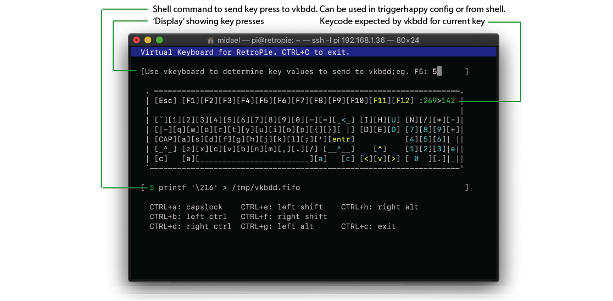

# vkbdd - virtual keyboard daemon for RetroPie

Vkbdd is a virtual keyboard daemon for sending key presses to RetroArch and Emulation Station in RetroPie. Vkbdd creates a virtual keyboard device that reads key presses from a named pipe and translates them to Linux keyboard events. It lets key presses to be generated programmatically or by manually echoing characters to the named pipe from the shell. When combined with triggerhappy (thd), RetroArch operations such as save and load game state, toggle FPS and others can be triggered from gamepad or from shell.

RetroPie (as of version 4.6) doesn't support triggering actions such as changing shaders or exiting the emulator by pressing an arbitrary combination of gamepad buttons (e.g. A+B+C). Some onerous workarounds by e.g. using xboxdrv do exist, but they can be daunting to setup and maintain. Vkbdd in combination with triggerhappy (thd) daemon solves this problem and allows sending key presses to Retroarch and Emulation Station based on button events from the gamepad. Vkbdd is specifically intended to be used with RetroPie, but it might be useful in other contexts where X-Window is replaced with custom application.

<!-- https://retropie.org.uk/forum/topic/9277/creating-save-states-with-a-single-button-press -->
<!-- https://github.com/nbedos/termtosvg -->

## Installation

To install vkbdd, ssh into or log in the RetroPie console (as of Retropie 4.6) and issue the following commands as user pi. This will install vkbdd daemon into `/usr/local/sbin`, vkeyboard 'client' to `/usr/local/bin` and create a systemd unit file vkbdd into `/lib/systemd/system` and enable loading of vkbdd at system startup.

```
$ sudo apt install git ncurses-dev
$ git clone https://github.com/etheling/vkbdd
$ cd vkbdd 
$ make
$ make install
```

## vkbdd

When Vkbdd is started it registers itself as a keyboard, and creates a named pipe (FIFO) /tmp/vkbdd.fifo. It then reads characters sent to the FIFO and translates them to keyboard events that it writes to /dev/uinput. Key presses can be sent to the named pipe from shell using e.g. echo or printf commands, or they can be generated programmatically from e.g. triggerhappy daemon. Please see the 'vkeyboard' section for examples of sending key presses to vkbdd. Vkbdd has to be run as a root, or permissions for /dev/uinput must be changed so that non-root users such as 'pi' can use it.

If installed as a service (see Makefile), vkbdd is started automatically on boot. It can be controlled with 'systemctl {start|stop|enable|disable|restart|status} vkbdd'. In default configuration a debug log is created to /tmp/vkbdd.debug.log. If invoked manually, vkbdd has following command-line interface:

```
# ./vkbdd -h
Virtual keyboard daemon for RetroPie - https://github.com/etheling/vkbdd
Arguments: -h 

Usage: ./vkbdd [OPTION..]
  -f        if named pipe exists, overwrite
  -h        print this help message
  -n        disable debug logging to /tmp/vkbdd.debug.log
  -p <file> path/file to named pipe to read (default /tmp/vkbdd.fifo)
  -u <user> username to chown pipe (default current user)
  -v        print program version and exit
```

NOTE: It is very important that `input_enable_hotkey =` is NOT set in any RetroArch config files. If enabled, for RetroArch to react to the key presses coming from vkbdd, also the hotkey would need to be pressed (which usually is not desirable). 

## vkeyboard

Vkeyboard is a command line utility to help find keycodes that should be sent to vkbdd to get a desired key press generated. Vkeyboard lets user type in characters, and it will display appropriate character value to send to vkbdd in upper right corner in decimal (e.g. 13 for Enter). It also provides complete command-line for using fprint command to send the key to vkbdd at the lower part of the screen (e.g. "printf '\015' > /tmp/vkbdd.fifo" to send Enter. Alternatively translations can be found from the [source](https://github.com/midael/retropie-vkbd/blob/master/src/vkbdd.c#L78).

```
$ ./vkeyboard -h
Virtual keyboard daemon client for RetroPie - https://github.com/etheling/vkbdd

Usage: ./vkeyboard [OPTION..]
  -h        print this help message
  -p <file> path/file to named pipe to read (default /tmp/vkbdd.fifo)
  -s        simulate and don't connect to or send key presses to named pipe
  -v        print program version and exit
```

For example to send key presses for character 'm' followed by ESC (to enable next shader (m), and then exit running emulator (ESC)) to RetroArch following shell commands can be used.

```
$ echo -n m > /tmp/vkbdd.fifo
$ printf '/033' > /tmp/vkbdd.fifo ; # note ESC is 27 decimal, which is 033 octal
```



NOTE: vkeyboard should probably be only used over SSH connection. Running it locally (e.g. running it on same hardware that keyboard is attached to) may cause key presses to be sent back to vkeyboard which will likely result as undefined behavior. If running vkeyboard locally is desired, then -s switch for simulate should be used to avoid forwarding the key presses to vkbdd.

## Sample triggerhappy configuration to use with vkbdd

Below is a sample triggerhappy configuration that uses vkbdd to convert gamepad button press combinations to key presses for RetroArch. When triggerhappy detects button event, or button combination, /usr/bin/printf is used to send key code to vkbdd FIFO to be converted into a key press (triggerhappy configs require absolute path to command). Mappings in the example are as follows and assume default RetroArch key bindings in RetroPie 4.6:

- Xbox button -> generate F1 key press to enter RetroArch menu
- select+start -> generate ESC to exit currently running emulator
- left joystick click + B -> generate 'm' key press to enable next shader
- left joystick click + X -> generate 'n' key press to enable previous shader
- left joystick click + Y -> generate F3 to toggle FPS display

```
pi@retropie:~ $ cat /etc/triggerhappy/triggers.d/vkbdd-retropie.conf
## xbox 360 wired controller
BTN_MODE			1	/usr/bin/printf '\212' > /tmp/vkbdd.fifo # F1 menu
BTN_SELECT+BTN_START		1	/usr/bin/printf '\033' > /tmp/vkbdd.fifo # ESC / exit emulator
BTN_THUMBL+BTN_B		1	/usr/bin/printf m > /tmp/vkbdd.fifo # next shader
BTN_THUMBL+BTN_NORTH		1	/usr/bin/printf n > /tmp/vkbdd.fifo # prev shader
BTN_THUMBL+BTN_WEST		1	/usr/bin/printf '\214' > /tmp/vkbdd.fifo # F3 fps on/off
```
NOTE: It is very important that `input_enable_hotkey =` is NOT set in any RetroArch config file or for any gamepad. If enabled, for RetroArch to react to the key presses coming from vkbdd, also the hotkey would need to be pressed.

# Security considerations

This daemon should only be used with a dedicated RetroPie system. Running it on a desktop / multi-user system is a bad idea as anyone logged in will be able to send key presses; e.g. commands as FIFO is created with file mask 0666 (prw-rw-rw-). In fact it's probably a bad idea to run it in RetroPie in some ways too. ;-) You've been warned. 

# Possible future improvements

- Allow sending separate {shift|ctrl|alt} press / release events
- Improve my ncurses-fu and fancify vkeyboard
- Improved permission / user / group options for FIFO
